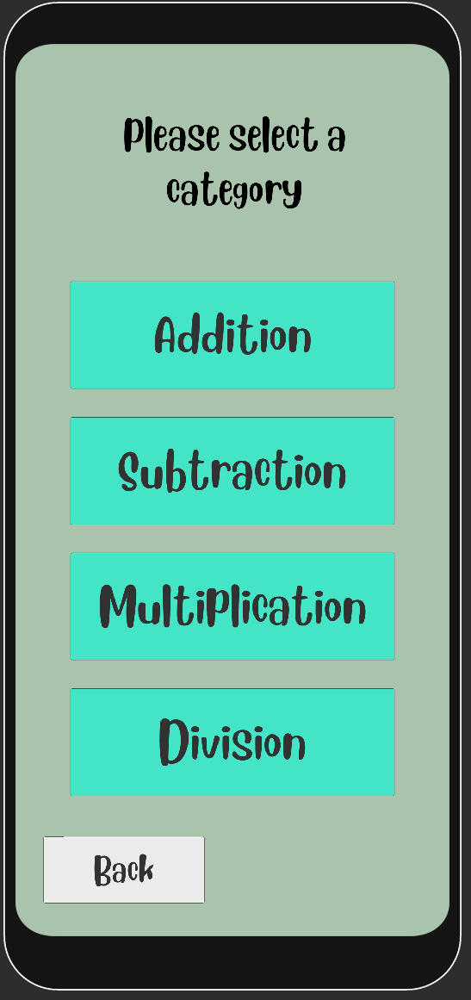
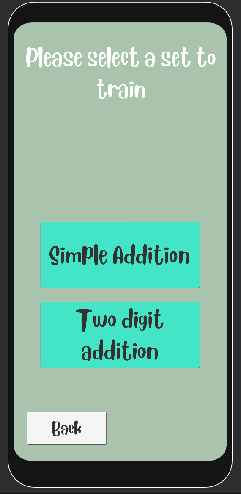
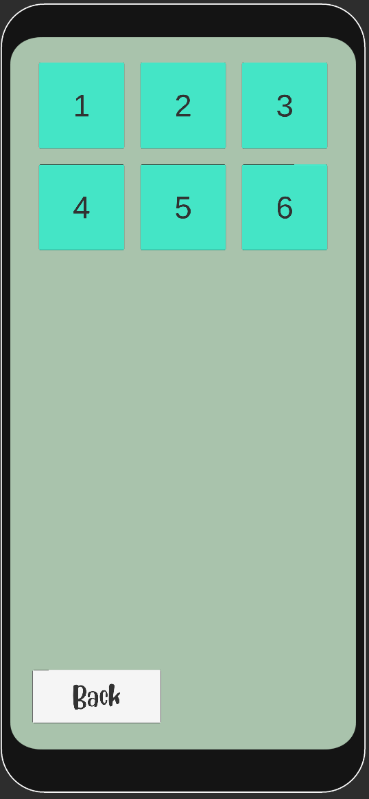
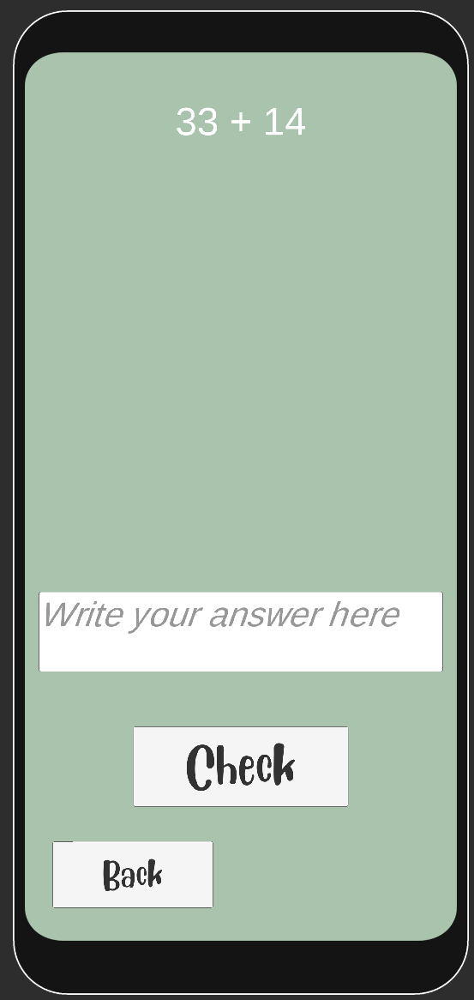
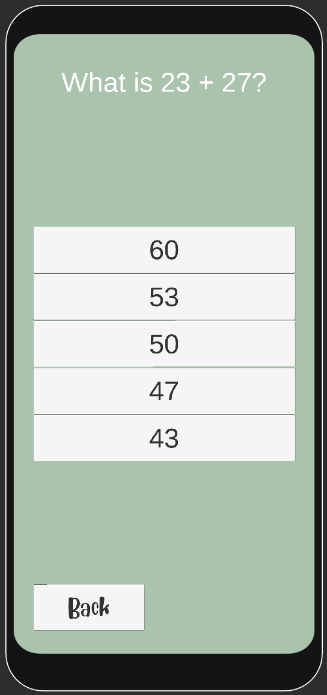

# illuma-learning-app
An educational game to help Kenya's youth increase their academic skills 

# Pictures
## Category selection menu

 
Is the first menu one gets shown once they press play. The user should click on
the category they want to train.

## Assignment set selection menu

 
Next menu displayed is the assignment set selection menu, were one
should choice the assignment set they would like to train.

## Level select

 
Displays all the levels/assignments within an assignment set.

# Assignment examples
## Text input assignment

 
In this assignment the user has to input the answer to the question in a text field.

## Multiple choice assignment

 
In this assignment the user gets a list of possible answers to the question.
The user should then chose the answer that they think is correct.

 

# General Notes
The app was designed and tested on the samsung galaxy s9, so might not work on phones with different aspect ratios etc.

# Tools used
This project was made with the game engine framework Unity.

 

# License
All code in this repository is licensed under the MIT License. Images, fonts and other assets are not licensed under MIT.

 

## Disclaimer
This is a school project and won't be maintained nor updated. This app is a prototype for a game which was designed to help increase the youths academic skills, so it might not work as expected. Also be aware that the code is a bit messy if you dare to look at it (:
